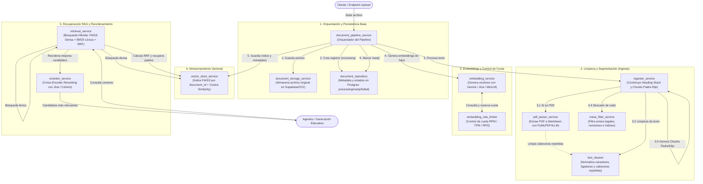

# Arquitectura y Flujo de Servicios — Backend NuevaMente (Fase 1)

> **Nota de Alcance:** Este documento corresponde a la **Fase 1: Ingestión, Segmentación, Embeddings, Indexación Vectorial y Recuperación RAG Base** (12 servicios).  
> La **Fase 2: Orquestación Multi-Agente, Generación Didáctica y Exportación** se documenta en su propio archivo independiente (`Fase_2_Orquestacion_Agentes.md`).

Este documento describe la arquitectura modular, funciones principales y el flujo de ejecución de los **12 servicios base** ubicados en `backend/app/services/`.

---

## 1. Diagrama de Flujo Integral (Mermaid)

El procesamiento se divide en dos grandes etapas:
1. **Pipeline de Ingestión e Indexación** (al subir un documento).
2. **Pipeline de Recuperación RAG y Reranking** (al consultar contexto para generar contenido educativo).

---

## 2. Clasificación por Fases y Responsabilidades

Los 12 servicios se organizan en **5 grandes áreas funcionales**:

| Fase / Grupo | Archivos / Servicios | Función Principal en el Sistema |
| :--- | :--- | :--- |
| **1. Orquestación y Persistencia Base** | • `document_pipeline_service.py` • `document_storage_service.py` • `document_repository.py` | Coordina el ciclo de vida del documento desde la subida hasta el estado final (`ready` o `failed`), almacenando el archivo físico original y sus metadatos en base de datos. |
| **2. Limpieza y Segmentación (Ingesta)** | • `pdf_parser_service.py` • `text_cleaner.py` • `noise_filter_service.py` • `ingester_service.py` | Transforma archivos crudos (.pdf, .md, .txt) en texto estructurado, eliminando contenido irrelevante y dividiéndolo en fragmentos jerárquicos Padre/Hijo con migas de pan (*breadcrumbs*). |
| **3. Embeddings y Control de Cuota** | • `embedding_rate_limiter.py` • `embedding_service.py` | Convierte texto en vectores semánticos con estrategia de fallback automático (Gemini $\to$ Jina $\to$ MiniLM) y control estricto de límites de API (RPM/TPM/RPD). |
| **4. Almacenamiento Vectorial** | • `vector_store_service.py` | Gestiona índices vectoriales locales (FAISS) aislados por `document_id` con cálculo de similitud de coseno y almacenamiento de metadatos asociados. |
| **5. Recuperación RAG y Reordenamiento** | • `retrieval_service.py` • `reranker_service.py` | Responde consultas mediante búsqueda híbrida (densa + dispersa BM25 fusionadas con RRF) y reordena los bloques resultantes con modelos Cross-Encoder. |

---

## 3. Detalle Servicio por Servicio

### Grupo 1: Orquestación y Persistencia Base

#### `document_pipeline_service.py` (Orquestador Central)
- **Rol:** Director de orquesta del pipeline de documentos. Une el almacenamiento, el repositorio, la ingesta, los embeddings y el vector store (ninguno de los cuales se conoce entre sí).
- **Entradas:** Archivo local recibido (`local_path`), título sugerido, `user_id` opcional, callback de progreso.
- **Salidas:** `DocumentRecord` final en estado `ready` o `failed`.
- **Funciones Clave:**
  - `register_document(...)`: Guarda el archivo en storage y crea la fila inicial `processing` de inmediato.
  - `process_registered_document(...)`: Ejecuta el parsing, filtrado, embeddings e indexación en segundo plano y marca `ready`.
  - `process_and_index_document(...)`: Wrapper síncrono para pruebas.

#### `document_storage_service.py` (Almacenamiento Físico y Artefactos)
- **Rol:** Abstracción unificada para guardar y recuperar el archivo binario original (`.pdf`, `.md`, `.txt`) y persistir artefactos educativos generados (`upload_json_artifact`) en Supabase Storage u OCI Object Storage.
- **Entradas:** Ruta local del archivo / payload JSON, `document_id`, `user_id`.
- **Salidas:** `object_key` único que identifica la ruta del archivo o artefacto dentro del bucket (`document-source` o `adapted-artifacts`).

#### `document_repository.py` (Repositorio de Metadatos)
- **Rol:** Manejo de la tabla `documents` en base de datos (PostgreSQL/Supabase). Rastrea el ciclo de vida del documento.
- **Entradas:** `document_id`, título, nombre de archivo fuente, `object_key`, estados.
- **Salidas:** Instancias de `DocumentRecord` con campos como `status` (`processing`, `ready`, `failed`), `total_parents`, `total_children`, `error_message`.

---

### Grupo 2: Limpieza y Segmentación (Ingesta)

#### `pdf_parser_service.py` (Extractor Estructurado de PDFs)
- **Rol:** Convierte PDFs técnicos en Markdown preservando títulos, listas y tablas mediante `pymupdf4llm`. Si el PDF no puede procesarse de forma estructurada, permite el fallback a texto plano de `pypdf`.
- **Entradas:** Ruta local al archivo PDF.
- **Salidas:** Texto completo del documento en formato Markdown limpio, sin cabeceras o pies de página repetitivos.

#### `text_cleaner.py` (Normalización de Texto)
- **Rol:** Limpia texto a bajo nivel: normaliza caracteres Unicode y ligaduras (`fi` $\to$ `fi`), elimina guiones de fin de línea (`proce-dimiento` $\to$ `procedimiento`), remueve números de página sueltos y descarta cabeceras/pies repetidos entre páginas.
- **Entradas:** Texto crudo o páginas extraídas.
- **Salidas:** Texto normalizado y despojado de artefactos tipográficos.

#### `noise_filter_service.py` (Filtro de Ruido Semántico)
- **Rol:** Detecta y descarta secciones no técnicas que ensucian la base de conocimiento: carátulas, avisos legales, licencias de copyright, historial de cambios de versión, tablas de contenido con puntos guía y separadores de capítulos vacíos.
- **Entradas:** Lista de secciones detectadas (`Section`).
- **Salidas:** Secciones filtradas y un reporte de ruido (`NoiseReport`) que documenta qué se descartó y el porcentaje eliminado.

#### `ingester_service.py` (Segmentador Jerárquico y Constructor RAG)
- **Rol:** Nuclea el flujo de ingesta: detecta encabezados jerárquicos usando una **pila (*Heading Stack*)** agnóstica del idioma, aplica limpieza y segmenta el texto en pares **Padre-Hijo (Parent-Child)**.
- **Entradas:** Ruta de archivo o texto directo.
- **Salidas:** `IngestedDocument` y `rag_payload` compuesto por:
  - `parent_chunks`: Bloques grandes contextuales (`CHUNK_SIZE ~ 1000 chars`) con su ruta de navegación (`breadcrumb`).
  - `child_chunks`: Fragmentos pequeños y densos (`CHILD_CHUNK_SIZE ~ 500 chars`) listos para el cálculo de embeddings.

---

### Grupo 3: Embeddings y Control de Cuota

#### `embedding_rate_limiter.py` (Limitador de Tasa Deslizante)
- **Rol:** Protege la aplicación contra errores `HTTP 429 Too Many Requests`. Administra una ventana deslizante en memoria para controlar peticiones por minuto (RPM), tokens por minuto (TPM) y límite diario (RPD) del proveedor Gemini.
- **Entradas:** Cantidad de textos a enviar y estimación de tokens.
- **Salidas:** Autorización de reserva (`reserve()`), estimación de espera en segundos (`estimate_wait()`) o excepción `RateLimitExceeded`.

#### `embedding_service.py` (Generador de Embeddings con Cascada)
- **Rol:** Calcula las representaciones vectoriales de los textos. Si el proveedor principal agota su cuota o falla, conmuta automáticamente en tiempo de ejecución:
  $$\text{Gemini (text-embedding-004)} \longrightarrow \text{Jina (jina-embeddings-v3)} \longrightarrow \text{MiniLM Local (sentence-transformers)}$$
- **Entradas:** Lista de textos (`child_chunks`), callback opcional de progreso.
- **Salidas:** Matriz de vectores de coma flotante (`List[List[float]]`) con dimensiones estandarizadas y normalizadas.

---

### Grupo 4: Almacenamiento Vectorial

#### `vector_store_service.py` (Motor de Búsqueda Vectorial FAISS)
- **Rol:** Administra los índices matemáticos de similitud de coseno. Asigna un índice FAISS aislado e independiente por cada `document_id` dentro de `data/vector_stores/{document_id}/`.
- **Entradas:** Vectores de embeddings, fragmentos hijos y metadatos de padres asociados.
- **Salidas:** Búsqueda k-NN rápida (`similarity_search`) que retorna los fragmentos hijos más cercanos con su score de similitud y resuelve el puntero a su bloque padre.

---

### Grupo 5: Recuperación RAG y Reordenamiento

#### `retrieval_service.py` (Motor de Búsqueda Híbrida)
- **Rol:** Ejecuta la recuperación de fragmentos relevantes para alimentar los agentes educativos:
  1. Realiza búsqueda semántica densa en FAISS.
  2. Realiza búsqueda léxica/palabras clave con BM25 (`rank_bm25`).
  3. Combina ambos rankings usando **Reciprocal Rank Fusion (RRF)**.
  4. Mapea los mejores fragmentos hijos a sus **bloques padres únicos**.
- **Entradas:** `document_id`, consulta construida (`query`), número de resultados (`top_k`).
- **Salidas:** Lista de bloques padre deduplicados y ordenados por score de relevancia fusionado.

#### `reranker_service.py` (Reordenador Cross-Encoder)
- **Rol:** Toma los candidatos preseleccionados por `retrieval_service` y los vuelve a calificar analizando conjuntamente los pares `(query, document)` con modelos de reordenamiento profundo (Jina Reranker v2 con fallback a Cohere Rerank v3).
- **Entradas:** `query`, lista de textos candidatos, cantidad final a devolver (`top_n`).
- **Salidas:** Lista ordenada de mayor a menor relevancia con scores normalizados de coincidencia semántica.
