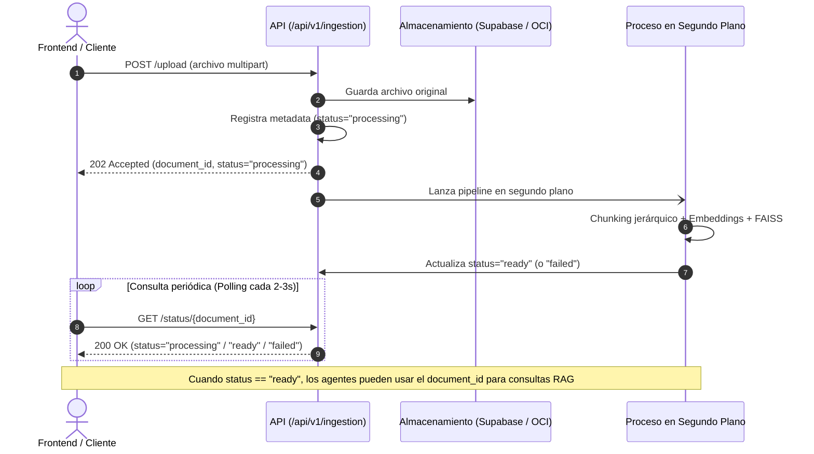

# Contrato de la API de Ingestión de Documentos

Este documento define la interfaz y contrato de comunicación para el proceso de ingesta, procesamiento, generación de embeddings e indexación vectorial en **NuevaMente**. Está dirigido a los equipos de **Frontend** y desarrollo de **Agentes**.

---

## 1. Flujo General de Ingestión

Debido a que el procesamiento de documentos (extracción de texto de PDFs complejos, filtrado de ruido, chunking jerárquico padre/hijo, cálculo de embeddings en lote y guardado del índice FAISS) toma varios segundos o minutos, el flujo se ejecuta de forma **asíncrona**:



---

## 2. Endpoints Disponibles

Base URL: `/api/v1/ingestion` (o el prefijo configurado en el servidor, e.g. `http://localhost:8000/api/v1/ingestion`)

---

### 2.1 Subir Documento para Procesamiento Asíncrono

Registra el documento, guarda el archivo en el bucket correspondiente y lanza la indexación vectorial en segundo plano.

- **Método:** `POST`
- **Ruta:** `/upload`
- **Content-Type:** `multipart/form-data`

#### Parámetros del Formulario (`form-data`):
| Campo | Tipo | Obligatorio | Descripción |
| :--- | :--- | :--- | :--- |
| `file` | File | **Sí** | Archivo `.pdf`, `.md` o `.txt`. Tamaño máx: según configuración (por defecto 25 MB). |
| `title` | string | No | Título personalizado. Si no se envía, se deduce del nombre del archivo. |
| `user_id` | string (UUID) | No | Identificador del usuario propietario (opcional hasta que exista autenticación). |

#### Respuestas:

##### `202 Accepted` (Éxito al encolar)
El documento fue recibido y registrado exitosamente:
```json
{
  "document_id": "c39b33a7-0275-4078-a3f2-187b5a198de2",
  "status": "processing",
  "title": "Manual de Arquitectura y Redes",
  "source_filename": "manual_redes.pdf",
  "message": "Document uploaded and accepted for processing."
}
```

##### `400 Bad Request` (Error de validación)
```json
{
  "detail": "Unsupported format: .docx. Supported formats: ['.pdf', '.md', '.txt']"
}
```

---

### 2.2 Consultar Estado del Procesamiento (Polling)

Permite al frontend o a los agentes verificar si el documento ya terminó de indexarse y está listo para generar contenido.

- **Método:** `GET`
- **Ruta:** `/status/{document_id}`

#### Parámetros de Ruta:
- `document_id` (string, UUID): El ID devuelto en el endpoint `/upload`.

#### Respuestas:

##### `200 OK` - Estado: En Proceso (`processing`)
```json
{
  "document_id": "c39b33a7-0275-4078-a3f2-187b5a198de2",
  "status": "processing",
  "title": "Manual de Arquitectura y Redes",
  "source_filename": "manual_redes.pdf",
  "total_parents": null,
  "total_children": null,
  "error_message": null,
  "created_at": "2026-10-02T15:30:00Z",
  "updated_at": "2026-10-02T15:30:00Z"
}
```

##### `200 OK` - Estado: Listo (`ready`)
```json
{
  "document_id": "c39b33a7-0275-4078-a3f2-187b5a198de2",
  "status": "ready",
  "title": "Manual de Arquitectura y Redes",
  "source_filename": "manual_redes.pdf",
  "total_parents": 14,
  "total_children": 68,
  "error_message": null,
  "created_at": "2026-10-02T15:30:00Z",
  "updated_at": "2026-10-02T15:30:45Z"
}
```

##### `200 OK` - Estado: Fallido (`failed`)
```json
{
  "document_id": "c39b33a7-0275-4078-a3f2-187b5a198de2",
  "status": "failed",
  "title": "Manual de Arquitectura y Redes",
  "source_filename": "manual_redes.pdf",
  "total_parents": null,
  "total_children": null,
  "error_message": "Error extracting text: PDF contains only scanned raster images without OCR text.",
  "created_at": "2026-10-02T15:30:00Z",
  "updated_at": "2026-10-02T15:30:10Z"
}
```

##### `404 Not Found`
```json
{
  "detail": "Document with ID 'c39b33a7-0275-4078-a3f2-187b5a198de2' not found."
}
```

---

### 2.3 Listar Todos los Documentos

Permite a la interfaz listar la biblioteca de documentos cargados.

- **Método:** `GET`
- **Ruta:** `/documents`
- **Query Params:**
  - `user_id` (opcional, string UUID): Filtra por usuario.

#### Respuestas:

##### `200 OK`
```json
[
  {
    "document_id": "c39b33a7-0275-4078-a3f2-187b5a198de2",
    "user_id": null,
    "title": "Manual de Arquitectura y Redes",
    "source_filename": "manual_redes.pdf",
    "object_key": "documents/c39b33a7-0275-4078-a3f2-187b5a198de2/manual_redes.pdf",
    "status": "ready",
    "total_parents": 14,
    "total_children": 68,
    "error_message": null,
    "created_at": "2026-10-02T15:30:00Z",
    "updated_at": "2026-10-02T15:30:45Z"
  }
]
```

---

## 3. Integración para el Grupo de Agentes

Cuando el documento alcanza el estado `"ready"`:
1. El índice vectorial FAISS y sus metadatos jerárquicos ya están persistidos en el almacenamiento local/compartido bajo la clave del `document_id`.
2. Cada fragmento (`ChildChunk`) y sección (`ParentChunk`) incluye el campo `breadcrumb` con la ruta completa (ej. `Manual BX-200 > Capítulo 1 > 1.1 Descripción general`).
3. Para recuperar contexto relevante en cualquier servicio de agentes:
   ```python
   from app.services.vector_store_service import get_store

   store = get_store(document_id)
   # Cada resultado contiene el breadcrumb para citar con precisión el capítulo y sección
   results = store.similarity_search("procedimiento de arranque", k=4)
   for doc in results:
       print(doc.metadata["breadcrumb"])
       print(doc.page_content)
   ```
